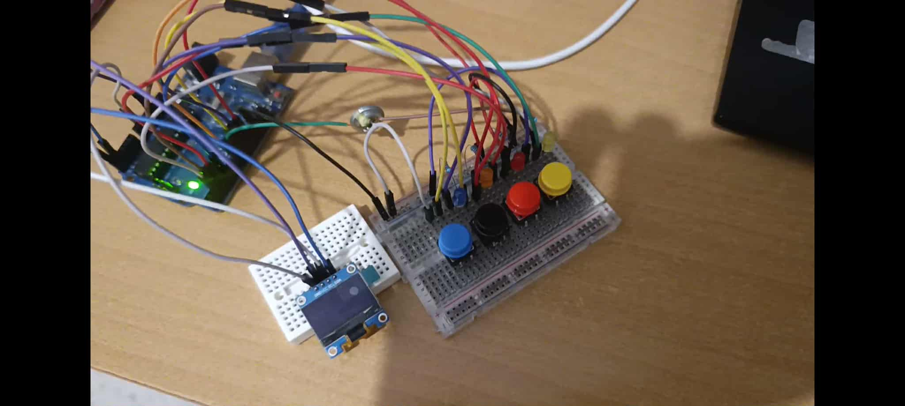

# 🎮 Arduino Memory Game

## 📝 Description
Un jeu de mémoire interactif basé sur Arduino UNO, avec 4 LED colorées, 4 boutons, un buzzer (haut-parleur d'écouteur) et un écran OLED. Le programme génère une séquence lumineuse et sonore aléatoire que le joueur doit reproduire. Le score augmente avec chaque succès, et une animation de visage pleurant avec musique de fin s'active en cas d'échec. Relancez une partie en appuyant sur les boutons de droite à gauche.

  
*Vue du montage : Arduino UNO connecté à une breadboard avec 4 LED (jaune, rouge, orangée, bleu), 4 boutons, un buzzer et un écran OLED.*

## ⚙️ Matériel utilisé
- 🟦 **Arduino UNO**
- 💡 **4 LED colorées** (jaune, rouge, orangée, bleu)
- 🔘 **4 boutons poussoirs**
- 🔊 **Haut-parleur d'écouteur (utilisé comme buzzer)**
- 🖥️ **Écran OLED SSD1306 (128x64 pixels)**

## 🛠️ Fonctionnalités principales
- Génération aléatoire d'une séquence de LED et de sons.
- Affichage du score sur l'écran OLED.
- Vérification des entrées utilisateur via les boutons.
- Animation de visage pleurant et musique de fin en cas d'échec.
- Relance du jeu en appuyant sur les boutons dans l'ordre (droite à gauche).

## 📂 Organisation du code
Le code source se trouve dans [`LED_game.ino`](LED_game.ino).

## 🔧 Dépendances
Ce projet utilise les bibliothèques Arduino suivantes :
- `Wire.h` : pour la communication I2C avec l'écran OLED
- `Adafruit_GFX.h` : pour les graphismes sur l'écran
- `Adafruit_SSD1306.h` : pour contrôler l'écran OLED

### Installation
1. Ouvrir l'IDE Arduino.
2. Aller dans **Sketch → Include Library → Manage Libraries...**.
3. Rechercher et installer :
   - **Adafruit_GFX**
   - **Adafruit_SSD1306**

## 🚀 Utilisation
1. Connecter les LED aux pins 8, 10, 11, 12 (voir code pour correspondance des couleurs).
2. Connecter les boutons aux pins 5, 2, 3, 4 avec des résistances pull-up internes.
3. Brancher le buzzer au pin 9.
4. Connecter l'écran OLED via I2C (SDA → A4, SCL → A5 sur Arduino UNO, adresse I2C 0x3C).
5. Téléverser le code `LED_game.ino` dans l'Arduino.
6. Mettre sous tension : le jeu commence avec une séquence d'animation, puis attend les entrées du joueur.
