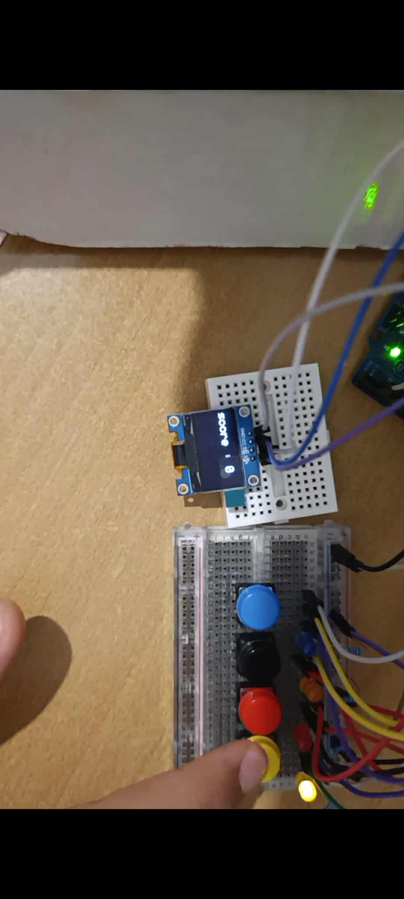
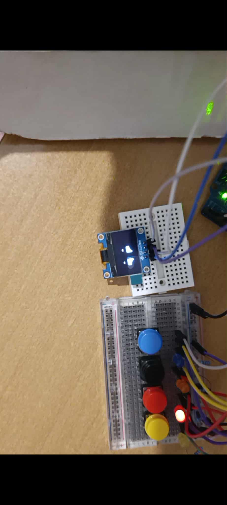

# 🎮 Arduino Memory Game avec OLED & Boutons

Un jeu de mémoire interactif réalisé avec **Arduino Uno**, où le joueur doit reproduire une séquence de lumières et de sons générés aléatoirement.  
Chaque manche ajoute un nouveau défi à la séquence. Une erreur et la partie est terminée !


---

## ✨ Fonctionnalités

- 4 **LEDs colorées** et 4 **boutons associés**
- **Haut-parleur (écouteur utilisé comme buzzer)** pour générer des mélodies
- **Écran OLED SSD1306** pour afficher le score et les animations
- **Séquence aléatoire** de lumières et sons
- **Affichage du score en direct**
- **Game Over** avec un visage triste 😢 et une musique de fin
- **Musique d’introduction et jeu de lumières**
- **Redémarrage du jeu** en appuyant sur tous les boutons de droite à gauche

---

## 🛠️ Matériel utilisé

- Arduino Uno  
- 4 LEDs colorées (jaune, orangée, noir, bleu)  
- 4 boutons poussoirs  
- 4 résistances pour les boutons/LEDs  
- 1 écouteur ou petit haut-parleur (buzzer improvisé 🎵)  
- 1 écran OLED SSD1306 (I2C)  
- Breadboards & câbles Dupont  

---

## 📸 Aperçu du jeu

- **Écran Score**  
  

- **Game Over (visage triste)**  
  

---

## 🚀 Comment jouer

1. Lancer l’Arduino : une **musique d’introduction** joue et un petit jeu de lumière démarre.  
2. Une LED s’allume et joue sa **tone** → appuyer sur le bouton correspondant.  
3. À chaque manche, une nouvelle LED s’ajoute à la séquence → répéter toute la suite !  
4. Si vous vous trompez → **Game Over** avec animation et musique de fin.  
5. Pour rejouer → appuyez sur tous les boutons **de droite à gauche** (jaune → orangée → noir → bleu).  

---

## 📂 Structure du projet

- `LED_game.ino` → code Arduino du jeu  
- `memory_game.jpg` → photo du montage complet  
- `score.jpg` → capture OLED affichant le score  
- `pleure.jpg` → capture OLED affichant le visage triste  

---

## 📖 Installation

1. Cloner ce dépôt  
   ```bash
   git clone https://github.com/<ton-user>/<ton-repo>.git
   cd <ton-repo>
